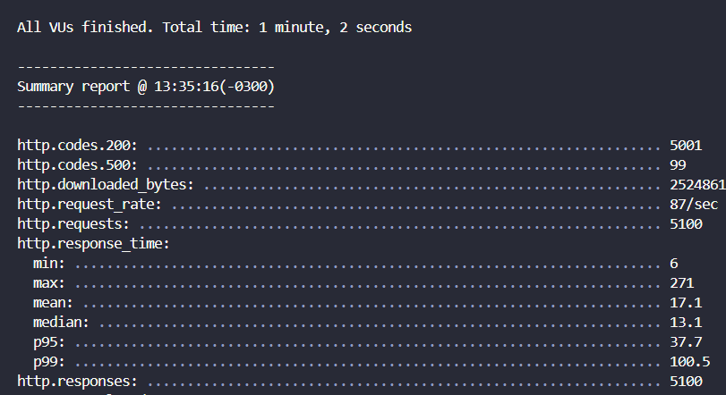
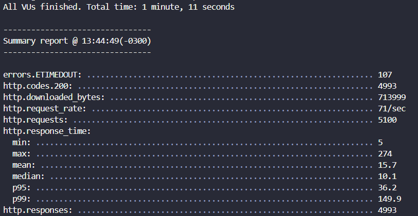
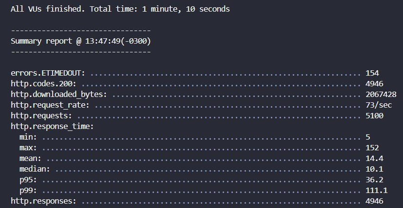
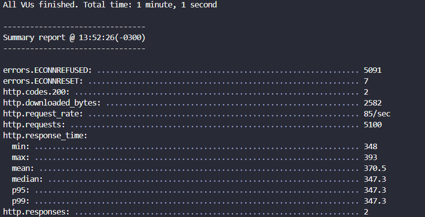
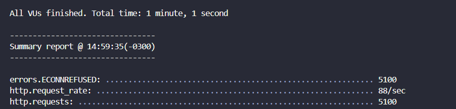
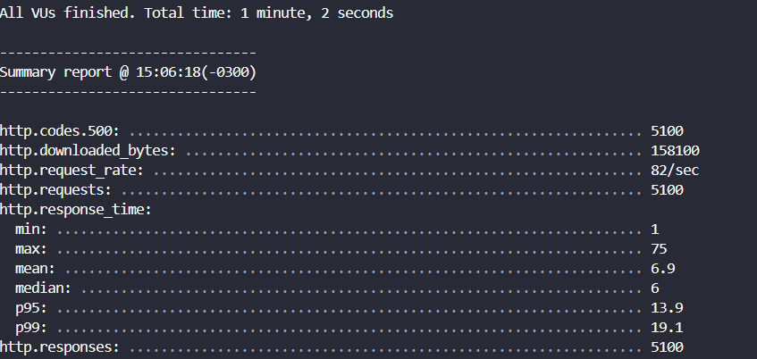
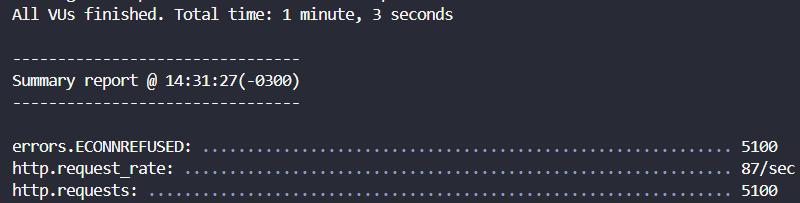

# Plano de Teste de Carga

## Objetivo

Avaliar a capacidade do sistema de gerenciamento de tarefas em lidar com um aumento de tráfego, simulando condições reais de uso. Nosso foco está nos tempos de resposta e na habilidade do sistema de manejar múltiplas conexões simultâneas.

## Escopo

Os testes de carga focarão nos seguintes endpoints da API:

- `GET /aulas/professores/:id`: Ver aulas por id do professor
- `GET /oficinas/:id`: Ver oficina por id da oficina
- `GET /oficinas/ongs/:id`: Ver oficinas por id da ong
- `GET /turmas/professores/:id`: Ver turmas por id do professor
- `POST /login`: Faz login de um usuário
- `POST /aulas`: Registra uma nova aula em uma turma
- `POST /presencas`: Registra a presença de um aluno

## Metodologia

Utilizamos scripts escritos em arquivos yaml, utilizando a biblioteca Artillery, para simular vários usuários virtuais fazendo solicitações HTTP simultâneas ao sistema. Os scripts geram cargas de teste incrementais, a fim de simular o contexto real do nosso cliente. Os testes começam com 20 usuários simultâneos e com um aumento de 20 usuários por segundo. A taxa de novos usuários gradualmente aumenta durante o 1 minuto de teste, até atingir a marca de 150 novos usuários por segundo, para testar a capacidade e a resiliência do sistema sob diferentes níveis de carga.

## Ferramentas

- **Yaml**: Para descrever e executar os scripts de simulação de carga.
- **Artillery**: Para rodar os testes de carga.

## Execução

1. **Preparação**:

- Descrever os os cenários e scripts de cada teste em um arquivo .yaml.
- Verificar se o servidor backend está rodando.
- Se a rota utilizar POST, prover os dados, de maneira correta, dentro do arquivo .yaml.

2. **Execução**: Rodar o seguinte comando no terminal, dentro da pasta src/API/testes-de-carga/rotas: artillery run 'nome do arquivo yaml'

3. **Monitoramento**: Observar o comportamento do sistema quanto a erros, tempos de resposta e status das requisições.

### Exemplo de Script .yaml para `GET /oficinas/:id`

```yaml
config:
  target: "http://localhost:5500" # URL da API que você quer testar
  phases:
    - duration: 60 # duração do teste em segundos
      arrivalRate: 100 # novos usuários virtuais por segundo
scenarios:
  - flow:
      - get:
          url: "/oficinas/1" # Caminho específico para testar
```

### Exemplo de Script .yaml para `POST /login`

```yaml
config:
  target: "http://localhost:5500"
  phases:
    - duration: 60
      arrivalRate: 10
      rampTo: 20

scenarios:
  - flow:
      - post:
          url: "/login"
          json:
            email: "joao@gmail.com"
            senha: "joao123"
```

## Relatório de Resultados

Após a execução dos testes, compilaremos os resultados observando:

- **Tempos de Resposta**: Média, mínimos e máximos.
- **Status das requisções**: 200, 500, entre outros.
- **Número de requisições feitas**: Quantas requisições foram feitas pelo teste.
- **Número de respostas recebidas**: Quantas das requisições feitas tiveram alguma resposta.
- **Análise de Performance**: Como o sistema lidou com diferentes níveis de carga, incluindo qualquer degradação de performance observada.

# Resultados

- `GET /aulas/professores/:id`: Ver aulas por id do professor
- `GET /oficinas/:id`: Ver oficina por id da oficina
- `GET /oficinas/ongs/:id`: Ver oficinas por id da ong
- `GET /turmas/professores/:id`: Ver turmas por id do professor
- `POST /login`: Faz login de um usuário
- `POST /aulas`: Registra uma nova aula em uma turma
- `POST /presencas`: Registra a presença de um aluno

## GET - /aulas/professores/:id



### Tempos de Resposta

- Média: 17.1 segundos
- Mínimo: 6 segundos
- Máximo: 271 segundos

### Status das Requisições

- 200 OK: 5001 respostas bem-sucedidas
- 500 Internal Server Error: 99 erros do servidor

### Número de Requisições e Respostas

- Requisições Feitas: 5100
- Respostas Recebidas: 5100

Os dados acima representam os resultados de um teste de carga executado na rota /aulas/professores/:id. A média do tempo de resposta indica que o servidor levou aproximadamente 17.1 segundos para responder às requisições em média, com algumas requisições sendo atendidas em um tempo tão rápido quanto 6 segundos e outras levando até 271 segundos.

O status de resposta HTTP 200 OK foi retornado em 5001 casos, significando que a maioria das requisições foi bem-sucedida. No entanto, houve 99 casos em que o servidor retornou o erro 500 Internal Server Error, o que indica problemas pontuais de estabilidade ou capacidade do servidor durante o teste.

O teste em si fez um total de 5100 requisições à rota especificada, e todas as requisições enviadas receberam alguma forma de resposta, seja ela um sucesso (200) ou um erro (500). Isso é indicativo de que o servidor foi capaz de processar e responder a todas as requisições feitas, embora com variação na qualidade da resposta.

## GET - /oficinas/:id



### Tempos de Resposta

- Média: 15.7 segundos
- Mínimo: 5 segundos
- Máximo: 274 segundos

### Status das Requisições

- 200 OK: 4993 respostas bem-sucedidas
- ETIMEDOUT: 107 timeouts

### Número de Requisições e Respostas

- Requisições Feitas: 5100
- Respostas Recebidas: 4993

Os dados acima representam os resultados de um teste de carga executado na rota /oficinas/:id. A média do tempo de resposta indica que o servidor levou aproximadamente 15.7 segundos para responder às requisições em média, com algumas requisições sendo atendidas em um tempo tão rápido quanto 5 segundos e outras levando até 274 segundos.

O status de resposta HTTP 200 OK foi retornado em 4993 casos, significando que a maioria das requisições foi bem-sucedida. No entanto, houve 107 casos de timeout (erro ETIMEDOUT), onde o servidor não respondeu no tempo esperado, indicando possíveis problemas de desempenho ou estabilidade na rota testada.

O teste realizou um total de 5100 requisições à rota especificada, e 4993 das requisições enviadas receberam resposta. As respostas perdidas estão representadas pelos timeouts, o que sugere que a capacidade de resposta do servidor pode ser insuficiente sob carga elevada ou que possam existir problemas de rede influenciando a conectividade

## GET - /oficinas/ongs/:id



### Tempos de Resposta

- Média: 14.4 segundos
- Mínimo: 5 segundos
- Máximo: 152 segundos

### Status das Requisições

- 200 OK: 4946 respostas bem-sucedidas
- ETIMEDOUT: 154 timeouts

### Número de Requisições e Respostas

- Requisições Feitas: 5100
- Respostas Recebidas: 4946

Os dados acima representam os resultados de um teste de carga executado na rota /oficinas/ongs/:id. A média do tempo de resposta indica que o servidor levou aproximadamente 14.4 segundos para responder às requisições em média, com algumas requisições sendo atendidas em um tempo tão rápido quanto 5 segundos e outras levando até 152 segundos.

O status de resposta HTTP 200 OK foi retornado em 4946 casos, indicando que a maior parte das requisições foi processada com sucesso. Entretanto, ocorreram 154 casos em que não houve resposta dentro do tempo esperado, resultando em timeouts. Isso pode sugerir que a rota testada tem problemas de estabilidade ou que a infraestrutura não é suficientemente robusta para lidar com a carga apresentada.

## GET - /turmas/professores/:id



### Tempos de Resposta
- Média: 370.5 milissegundos
- Mínimo: 348 milissegundos
- Máximo: 393 milissegundos

### Status das Requisições
- 200 OK: 2582 respostas bem-sucedidas
- ECONNREFUSED: 5091 conexões recusadas
- ECONNRESET: 7 conexões reinicializadas

### Número de Requisições e Respostas
- Requisições Feitas: 5100
- Respostas Recebidas: 2582

Os dados acima representam os resultados de um teste de carga executado na rota /turmas/professores/:id. A média do tempo de resposta indica que o servidor levou aproximadamente 370.5 milissegundos para responder às requisições em média, com o tempo de resposta variando de um mínimo de 348 milissegundos a um máximo de 393 milissegundos.

O status de resposta HTTP 200 OK foi retornado em 2582 casos, indicando que as requisições foram processadas com sucesso. No entanto, houve uma quantidade significativa de 5091 casos de ECONNREFUSED, o que sugere que o servidor estava indisponível ou recusando conexões, e 7 casos de ECONNRESET, onde a conexão foi reinicializada. Esses erros podem indicar problemas de estabilidade na rota testada ou que a infraestrutura não está adequada para suportar a carga imposta pelo teste.

## POST - /login



### Status das Requisições
- ECONNREFUSED: 5100 conexões recusadas
- Número de Requisições e Respostas

### Requisições Feitas: 5100
- Taxa de Requisição: 88 requisições por segundo

Os dados acima representam os resultados de um teste de carga realizado na rota /login. Nota-se que todas as 5100 tentativas de conexão resultaram em erros ECONNREFUSED, o que indica que o servidor recusou todas as conexões de entrada. A taxa de requisição foi de 88 requisições por segundo.

Este resultado sugere que o servidor de login não estava disponível para processar as requisições durante o teste. Isso pode ser devido a uma variedade de fatores, incluindo problemas de configuração, capacidade insuficiente de recursos para lidar com o volume de requisições ou possíveis falhas de segurança que podem ter causado um bloqueio automático devido ao número elevado de tentativas de acesso.

## POST - /aulas



### Tempos de Resposta
Média: 6.9 segundos
Mínimo: 1 segundo
Máximo: 75 segundos
Mediana: 6 segundos
P95: 13.9 segundos
P99: 19.1 segundos

### Status das Requisições
500 Internal Server Error: 5100 erros

### Número de Requisições e Respostas
Requisições Feitas: 5100
Taxa de Requisição: 82 requisições por segundo
Bytes Baixados: 158100

Os dados acima representam os resultados de um teste de carga realizado na rota /aulas. Observa-se que a média do tempo de resposta foi de 6.9 segundos, indicando que o servidor demorou significativamente para responder às requisições. A resposta mais rápida foi de 1 segundo e a mais lenta de 75 segundos. As métricas P95 e P99 mostram que 95% e 99% das requisições, respectivamente, foram respondidas em menos de 13.9 e 19.1 segundos.

Todos os 5100 testes resultaram em um status HTTP 500, o que significa que cada tentativa de requisição terminou em um erro de servidor interno. Esse status sugere problemas com a aplicação no servidor, como bugs no código, falhas de dependências ou questões relacionadas ao banco de dados.

## POST - /presencas



### Status das Requisições
ECONNREFUSED: 5100 conexões recusadas

### Número de Requisições e Respostas
Requisições Feitas: 5100
Taxa de Requisição: 87 requisições por segundo

Os dados acima representam os resultados de um teste de carga na rota /presenca. Infelizmente, todas as 5100 requisições feitas foram recusadas, como indicado pelo erro ECONNREFUSED. Isso sugere que o servidor estava inacessível ou que havia algum problema de configuração que impedia o estabelecimento de conexões. Com uma taxa de requisição de 87 por segundo, pode-se inferir que a infraestrutura atual não conseguiu lidar com essa carga ou que houve uma indisponibilidade durante o período de teste.
